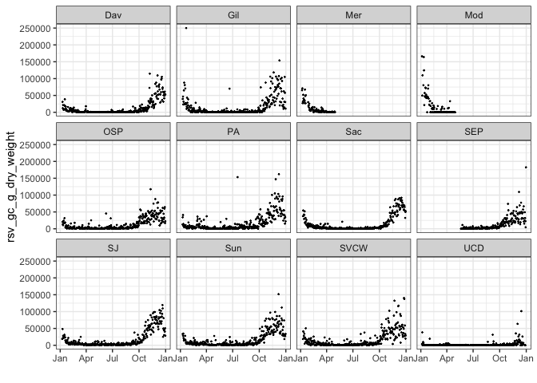
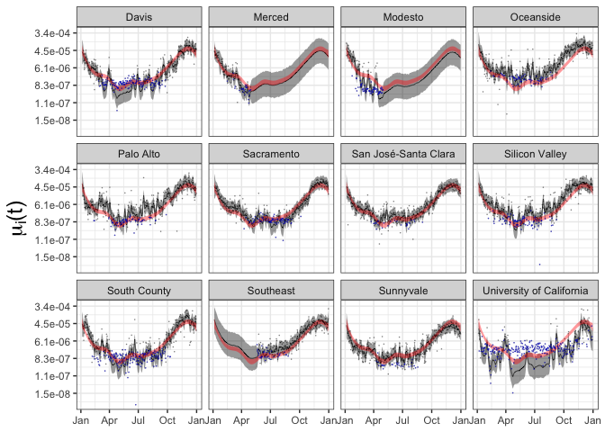
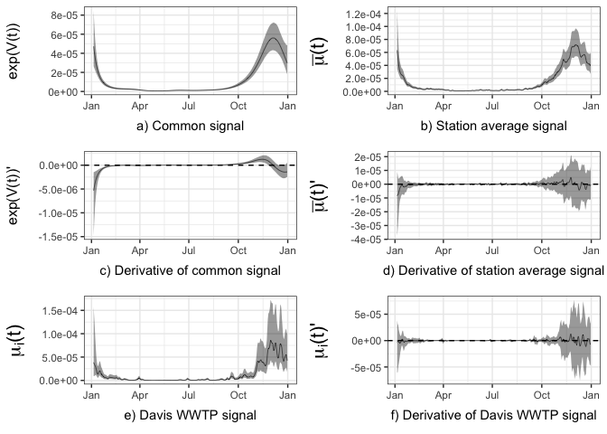
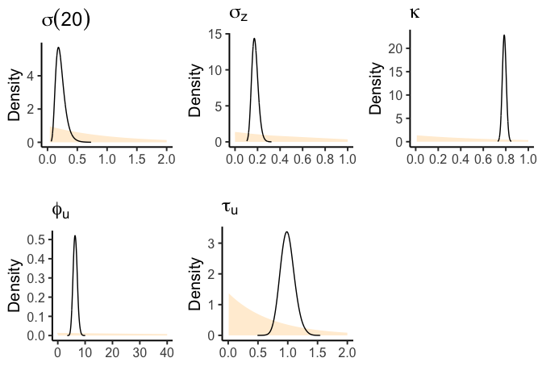

<!-- README.md is generated from the README.Rmd. Please edit that file -->

# RSV concentrations in Central California, USA

This is the code to replicate the results in Section 3.2 of the
manuscript. You will need the following libraries. The R version used
for this analysis and the package versions are listed below.

``` r
# > sessionInfo()
# R version 4.4.1 (2024-06-14) -- "Race for Your Life"
# Platform: aarch64-apple-darwin20
# Running under: macOS Monterey 12.4

# To install OSplines package
# install.packages("remotes")
# remotes::install_github("AgueroZZ/OSplines")

library(OSplines) # OSplines_0.1.1
library(aghq) # aghq_0.4.1
library(readr) # readr_2.1.5
library(dplyr) # dplyr_1.1.4
library(magrittr) # magrittr_2.0.3 
library(lubridate) # lubridate_1.9.3 
library(Matrix) # Matrix_1.7-0 
library(TMB) # TMB_1.9.14 
library(ggplot2) # ggplot2_3.5.1
library(janitor) # janitor_2.2.0
library(cowplot) #cowplot_1.1.3
library(reshape2) #reshape2_1.4.4
```

You will need to source the following functions, provided in this
folder.

``` r
source('prep_data.R')
source('process_results.R')
```

## Data

The RSV concentration data is found in the data folder and it was
download from <https://purl.stanford.edu/cx529np1130>. Set your working
directory to Section 3.2 and run the following code:

``` r
raw_d <- read_csv("./data/SCAN_AllPlants_SDR_7April23_rev.csv")

# creating a sample_date and renaming the station column
raw_d <- raw_d %>% 
  mutate(sample_date = ymd(paste0(Year,"-",Month,"-",Day))) %>% 
  rename(site_id = `Plant Abbr`) 

# clean column names (might not need it's my habit)
work_d <- raw_d %>% clean_names() 
```

Here is a plot of the raw data, note if a “0” appears, it means the
assay was a non-detect. The detection limit varies by sample depending
on the amount of solids by dry weight included, but is between 500–1000
cp/g dry weight. RSV measurements begin on January 5th, 2022. More
information about the data is found in
<https://www.nature.com/articles/s41597-023-02297-7>.

``` r
ggplot(work_d %>% filter(sample_date >= "2022-01-05"), aes(sample_date,rsv_gc_g_dry_weight))+ 
  geom_point(size=0.2)+
  facet_wrap(~site_id, nrow = 3)+ 
  scale_x_date(breaks=scales::pretty_breaks(n=5), name = "",date_labels ="%b")+
  theme_bw()
```



## Prepping Data for Modeling

The function “prep_data” will prepare the data for modeling. An example
of how to use this function and important notes for its use are found
below.

- Important Notes about Normalization:
  - If no normalization variable is used, then create a denominator
    column with values of ones
    - Example: “mutate(denom = 1)” and denom_column_name = “denom” in
      prep_data( ) function
  - In this example, we will use PMMoV t normalize RSV concentrations.
  - Both PMMoV and RSV concentrations are measured as gc/g and therefore
    the PMMoV-normalized RSV concentrations are unitless.
- Important Notes about Censoring:
  - If no outcome values are censored, create a censored_y column with
    values of FALSE
    - Example: mutate(censored_y = FALSE)
  - If outcome values are censored, do the two following things:
    - Set the censored outcome values to the detection limit.
    - create a censored_y column with values of FALSE if the outcome is
      observed and values of TRUE if the outcome is censored.
  - In this example, we have censored values and we will use the
    detection limit of 1000 cp/g.

``` r
# In this example, 
## pm_mo_v_gc_g_dry_weight is used for normalization
## the outcome is RSV_gc_g_dry_weight
## RSV_gc_g_dry_weight values are set to 0 if censored

# So following the censored instructions above: 
work_d <- work_d %>% 
  mutate(censored_y = ifelse(rsv_gc_g_dry_weight == 0, TRUE, FALSE), # create censored_y column
         y = ifelse(rsv_gc_g_dry_weight==0, 1000, rsv_gc_g_dry_weight)) # set censored values to limit

data_foranalysis <- prep_data(outcome_column_name = "y",
                    denom_column_name = "pm_mo_v_gc_g_dry_weight",
                    site_id = "site_id",   # column for wastewater station IDs
                    sample_date = "sample_date",  #date column. Should be year-month-day
                    data = work_d, # put the working data set
                    polyOrder =3) #polynomial order for the Ospline (we recommend 3 for wastewater data)

tmbdat <- data_foranalysis$tmbdat

summary(data_foranalysis$tmbdat)
```

    ##              Length   Class     Mode   
    ## Xfstat          39710 dgTMatrix S4     
    ## X_global        10830 dgTMatrix S4     
    ## X               50540 dgTMatrix S4     
    ## B              180500 dgTMatrix S4     
    ## P                2500 dgTMatrix S4     
    ## daily         1563852 dgTMatrix S4     
    ## obs          15638520 dgTMatrix S4     
    ## logPdet             1 -none-    numeric
    ## y                3610 -none-    numeric
    ## n1                 13 -none-    numeric
    ## stationsizes       12 -none-    numeric
    ## denom            3610 -none-    numeric
    ## y_ind_obs        2533 -none-    numeric
    ## y_ind_cens       1077 -none-    numeric
    ## cens_dir         1077 -none-    numeric
    ## station         43320 dgTMatrix S4     
    ## knots              51 -none-    numeric

## Prior Specifications

The priors for the OSpline global coefficients and station fixed effects
are independent normal with mean 0 and precision “betaprec”. The prior
for the standard deviation of the $\sigma_v$ of the common station
effect, modeled as an integrated Wiener process (IWP), is assigned using
the concept of predictive standard deviation (PSD). In the bottom
example, we place a prior on the 20 day PSD:
$P(\sigma(20) > \log(2)) = 0.5$. The function “prior_conversion”
converts this prior to one for the standard deviation parameter
$\sigma_v$.

``` r
polyOrder=3
prior_IWP <- prior_conversion(d=20, prior =list(u=log(2),alpha = 0.5),p=polyOrder)

# Set other priors
tmbdat$betaprec = 0.01
tmbdat$u1 = prior_IWP$u  
tmbdat$alpha1 = prior_IWP$a
tmbdat$u2 = 0.5
tmbdat$alpha2 = 0.5
tmbdat$lambda_phi = -log(0.5)/50
tmbdat$lambda_tau = -log(0.5)/0.5
tmbdat$lambda_cov = -log(0.5)/0.5
```

## Fitting the Proposed Model

``` r
# Need to compile the C++ code to fit the proposed model for censored data
compile(file="./cpp/model_ospline_fixedeffects_daily_singleCOV_AR2_transformpaper_censored.cpp")
try(dyn.unload(dynlib("./cpp/model_ospline_fixedeffects_daily_singleCOV_AR2_transformpaper_censored")),silent = TRUE)
dyn.load(dynlib("./cpp/model_ospline_fixedeffects_daily_singleCOV_AR2_transformpaper_censored"))

# Set initial values
set.seed(2)
init_daily <- rnorm(ncol(tmbdat$daily), 0, 0.1);
init_W <- rnorm(ncol(tmbdat$obs),0,0.1)
tmbparams <- list(
  W = c(rep(0, (ncol(tmbdat$X)+ ncol(tmbdat$B))), init_daily, init_W, 0,diff(init_W)), # W = c(U,beta,Z); U = B-Spline coefficients
  theta1 = 0, # -2log(sigma)
  theta2 = 0,
  cov_log = 0,
  theta3 = 0,
  theta4 = 0
)

ff <- TMB::MakeADFun(
  data = tmbdat,
  parameters = tmbparams,
  random = "W",
  DLL = "model_ospline_fixedeffects_daily_singleCOV_AR2_transformpaper_censored",
  silent = TRUE
)

aghq_k = 3
mdl1 <- suppressWarnings(aghq::marginal_laplace_tmb(ff,k=aghq_k,startingvalue = c(0,0,0,0,0)))

samps1 <- aghq::sample_marginal(mdl1, M = 3000) 
marginals <- mdl1$marginals

# At this point, we recommend saving the results.
# You can save the full model or you can save important bits as shown below.
df_full <- data_foranalysis$df_full
save(file="model1.RData", list = c("df_full","marginals","samps1","tmbdat","polyOrder"))
```

## Processing the Results of the Proposed Model

``` r
load("model1.RData")
# This code can take a little while to run. I would suggest saving the results after you run it. 
#id_group = 0 for none, =1 for station average, =2 for custom average
# if id_group = 2, id_group_name = name of the column for the group identifier. For example, in Section 3.1, the city averaged COVID-19 signal. 
# you would create a column for the city identifier. 

model_results <- process_results(df_full, 
                                 tmbdat, 
                                 samps1, 
                                 polyOrder,
                                 id_group = 1,  # 0 = none, 1 = station average, 2 = custom average
                                 id_group_name = NULL) # if id_group = 2, select group for custom average

df_full <- model_results$df_full
station_ave_df = model_results$station_ave_df
df_names = data.frame(site_id = c("Dav",
                                  "Gil",
                                  "Mer",
                                  "Mod",
                                  "OSP",
                                  "PA",
                                  "Sac",
                                  "SJ",
                                  "SVCW",
                                  "Sun",
                                  "SEP",
                                  "UCD"),
                      site_name = c("Davis",
                                    "South County",
                                    "Merced",
                                    "Modesto",
                                    "Oceanside",
                                    "Palo Alto",
                                    "Sacramento",
                                    "San José-Santa Clara",
                                    "Silicon Valley",
                                    "Sunnyvale",
                                    "Southeast",
                                    "University of California"))

df_full <- df_full %>% 
  left_join(df_names, by = "site_id")
```

### Figure 2 in Manuscript

``` r
gg1 <- df_full %>% 
  mutate(norm = y/denom) %>% 
  ggplot(aes(x = sample_date,norm)) +
  facet_wrap(~site_name, nrow = 3)+
  geom_line(aes(y = exp_v_u_fixed),size=0.2) + 
  geom_ribbon(aes(ymax = exp_v_u_fixed_upr, ymin = exp_v_u_fixed_lwr), alpha = 0.4, size = 0.2, fill = "black") +
  geom_ribbon(aes(ymax =exp_v_upr, ymin = exp_v_lwr), alpha = 0.4, size = 0.2, fill = "red") +
  theme_bw()+
  geom_point(alpha =0.5, shape = 16, size = 0.2)+
  geom_point(data=df_full %>% mutate(norm = y/denom)  %>% filter(censored_y == TRUE),col = "blue",alpha =0.5, shape = 16, size = 0.2)+
  scale_y_continuous(name = expression(paste(mu[i],"(t)")), 
                     trans="log",
                     labels = function(x)format(x,digits=2, scientific = TRUE),
                     breaks = scales::trans_breaks(function(x)log(x),function(x)exp(x),n=5))+ 
  scale_x_date(breaks=scales::pretty_breaks(n=8), name = "",date_labels ="%b")+
  theme(axis.title.y = element_text(size = 18),
        axis.title.x = element_blank())

gg1
```



### Plots in the Appendix: Figure 8

``` r
## exp(V(t))

gg1 <- df_full %>% 
  group_by(sample_date) %>% 
  slice(1) %>%
  ungroup() %>% 
  ggplot(aes(x = sample_date, y)) +
  geom_line(aes(y = exp_v),size=0.2) + 
  geom_ribbon(aes(ymax = exp_v_upr, ymin = exp_v_lwr), alpha = 0.4, size = 0.2, fill = "black") +
  theme_bw()+
  scale_y_continuous(name = "exp(V(t))", 
                     breaks = scales::pretty_breaks(n=5),
                     labels = function(x){format(x, scientific = TRUE)})+ 
  scale_x_date(breaks=scales::pretty_breaks(n=10), name = "",date_labels ="%b")+
  theme(axis.title.y = element_text(size = 12),
        axis.text.x.top = element_text(vjust = -68),
        axis.ticks.x.top = element_blank(),
        axis.title.x = element_blank())

#### V(t)

gg2 <- df_full %>% 
  group_by(sample_date) %>%
  slice(1) %>% 
  ungroup() %>% 
  ggplot(aes(x = sample_date,y)) + 
  geom_line(aes(y = exp_v_deriv),size=0.2) + 
  geom_ribbon(aes(ymax = exp_v_deriv_upr, ymin = exp_v_deriv_lwr), alpha = 0.4, size = 0.2, fill = "black") +
  theme_bw()+
  scale_y_continuous(name = "exp(V(t))'", 
                     breaks = scales::pretty_breaks(n=5),
                     labels = function(x){format(x, scientific = TRUE)})+ 
  geom_hline(yintercept=0, lty="dashed")+
  scale_x_date(breaks=scales::pretty_breaks(n=10), name = "",date_labels ="%b")+
  theme(axis.title.y = element_text(size = 12),
        axis.text.x.top = element_text(vjust = -68),
        axis.ticks.x.top = element_blank(),
        axis.title.x = element_blank())


gg3 <- station_ave_df %>%
  ggplot(aes(x = sample_date, ave_exp_v_u_fixed)) +
  geom_line(size=0.2) +
  geom_ribbon(aes(ymax = ave_exp_v_u_fixed_upr, ymin = ave_exp_v_u_fixed_lwr), alpha = 0.4, size = 0.2, fill = "black") +
  theme_bw()+
  scale_y_continuous(name = expression(paste(bar(mu),"(t)")),
                     breaks = scales::pretty_breaks(n=5),
                     labels = function(x){format(x, scientific = TRUE)})+
  scale_x_date(breaks=scales::pretty_breaks(n=10), name = "",date_labels ="%b")+
  theme(axis.title.y = element_text(size = 16),
        axis.text.x.top = element_text(vjust = -68),
        axis.ticks.x.top = element_blank(),
        axis.title.x = element_blank())

gg4 <- station_ave_df %>%
  ggplot(aes(x = sample_date,ave_exp_v_u_fixed_deriv)) +
  geom_line(size=0.2) +
  geom_ribbon(aes(ymax = ave_exp_v_u_fixed_deriv_upr, ymin = ave_exp_v_u_fixed_deriv_lwr), alpha = 0.4, size = 0.2, fill = "black") +
  theme_bw()+
  scale_y_continuous(name = expression(paste(bar(mu),"(t)'")),
                     breaks = scales::pretty_breaks(n=5),
                     labels = function(x){format(x, scientific = TRUE)})+
  geom_hline(yintercept=0, lty="dashed")+
  scale_x_date(breaks=scales::pretty_breaks(n=10), name = "",date_labels ="%b")+
  theme(axis.title.y = element_text(size = 16),
        axis.text.x.top = element_text(vjust = -68),
        axis.ticks.x.top = element_blank(),
        axis.title.x = element_blank())

gg5 <- df_full %>% 
  group_by(sample_date) %>% 
  filter(site_id == "Dav") %>%
  ggplot(aes(x = sample_date, y)) +
  geom_line(aes(y = exp_v_u_fixed),size=0.2) + 
  geom_ribbon(aes(ymax = exp_v_u_fixed_upr, ymin = exp_v_u_fixed_lwr), alpha = 0.4, size = 0.2, fill = "black") +
  theme_bw()+
  # facet_wrap(~site_id)+
  scale_y_continuous(name = expression(paste(mu[i],"(t)")), 
                     breaks = scales::pretty_breaks(n=5),
                     labels = function(x){format(x, scientific = TRUE)})+ 
  scale_x_date(breaks=scales::pretty_breaks(n=10), name = "",date_labels ="%b")+
  theme(axis.title.y = element_text(size = 16),
        axis.text.x.top = element_text(vjust = -68),
        axis.ticks.x.top = element_blank(),
        axis.title.x = element_blank())

gg6 <- df_full %>% 
  group_by(sample_date) %>% 
  filter(site_id == "Dav") %>%
  ggplot(aes(x = sample_date, y)) +
  geom_line(aes(y = exp_v_u_fixed_deriv),size=0.2) + 
  geom_ribbon(aes(ymax = exp_v_u_fixed_deriv_upr, ymin = exp_v_u_fixed_deriv_lwr), alpha = 0.4, size = 0.2, fill = "black") +
  theme_bw()+
  # facet_wrap(~site_id)+
  scale_y_continuous(name = expression(paste(mu[i],"(t)'")), 
                     breaks = scales::pretty_breaks(n=5),
                     labels = function(x){format(x, scientific = TRUE)})+ 
  scale_x_date(breaks=scales::pretty_breaks(n=10), name = "",date_labels ="%b")+
  theme(axis.title.y = element_text(size = 16),
        axis.text.x.top = element_text(vjust = -68),
        axis.ticks.x.top = element_blank(),
        axis.title.x = element_blank())+  
  geom_hline(yintercept=0, lty="dashed")


fest1 = plot_grid(add_sub(gg1,"a) Common signal",size = 11),
                           add_sub(gg3,"b) Station average signal",size = 11),
                           add_sub(gg2,"c) Derivative of common signal",size = 11),
                           add_sub(gg4,"d) Derivative of station average signal",size = 11),
                           add_sub(gg5,"e) Davis WWTP signal",size = 11),
                           add_sub(gg6,"f) Derivative of Davis WWTP signal",size = 11),
                           ncol=2, align="v", byrow = TRUE) 

fest1
```

<!-- -->

### Plots in the Appendix: Figure 9

``` r
# Prediction SD

theta_logprior <- function(theta,prior_alpha = tmbdat$alpha1,prior_u = c(tmbdat$u1)) {
  lambda <- -log(prior_alpha)/prior_u
  log(lambda/2) - lambda * exp(-theta/2) - theta/2
}
priorfunc <- function(x) exp(theta_logprior(x))
priorfuncsigma <- function(x) (2/x) * exp(theta_logprior(-2*log(x)))


### Inference for the smoothing parameter:
prec_marg <- marginals[[1]]
logpostsigma <- compute_pdf_and_cdf(prec_marg,list(totheta = function(x) -2*log(x),fromtheta = function(x) exp(-x/2)),interpolation = 'spline')
smooth_var <- data.frame(SD = logpostsigma$transparam, 
                         density = logpostsigma$pdf_transparam,
                         prior = priorfuncsigma(logpostsigma$transparam))
smooth_var <- rbind(smooth_var, data.frame(SD = 0, density = 0, prior = priorfuncsigma(.Machine$double.eps)))

smooth_var <- data.frame(SD = logpostsigma$transparam, 
                         density = logpostsigma$pdf_transparam)

orig <- log(2)
c <- orig/tmbdat$u1
smooth_var_prior <- data.frame(SD = seq(0, 3/400,0.0001)) %>% 
  mutate(prior = priorfuncsigma(SD),
         prior2 = dexp(c*SD, -log(0.5)/orig))


posterior_sigma_s <- smooth_var_prior %>% 
  ggplot(aes(x = c*SD, y = prior/c)) + 
  geom_area(fill = "orange", alpha = 0.2) +
  theme_classic(base_size = 15) +
  ylab("Density") + 
  scale_x_continuous(name = "",limits = c(0,2), breaks=scales::pretty_breaks(n=6) )+
  geom_line(data= smooth_var, aes(x = c*SD, y = density/c)) 

### Daily RE SD

theta_logprior <- function(theta,prior_alpha = tmbdat$alpha2,prior_u = c(tmbdat$u2)) {
  lambda <- -log(prior_alpha)/prior_u
  log(lambda/2) - lambda * exp(-theta/2) - theta/2
}
priorfunc <- function(x) exp(theta_logprior(x))
priorfuncsigma <- function(x) (2/x) * exp(theta_logprior(-2*log(x)))

prec_marg <- marginals[[2]]
logpostsigma <- compute_pdf_and_cdf(prec_marg,list(totheta = function(x) -2*log(x),fromtheta = function(x) exp(-x/2)),interpolation = 'spline')
smooth_var <- data.frame(SD = logpostsigma$transparam, 
                         density = logpostsigma$pdf_transparam,
                         prior = priorfuncsigma(logpostsigma$transparam))

smooth_var_prior <- data.frame(SD = c(smooth_var$SD), 
                               prior = c(smooth_var$prior))

smooth_var_prior <- rbind(smooth_var_prior, 
                          data.frame(SD = c(0,1), prior = priorfuncsigma(c(.Machine$double.eps,1))))


posterior_sigma_z <- smooth_var_prior %>% ggplot(aes(x = SD, y = prior)) + 
  geom_area(fill = "orange", alpha = 0.2) +
  theme_classic(base_size = 15) +
  geom_line(aes(x = SD, y = density), linetype="solid", data = smooth_var) +
  ylab("Density") +
  xlab("") + theme(legend.position = "none")+
  scale_x_continuous(name = "",limits = c(0,1), breaks=scales::pretty_breaks(n=6) )


## Coefficient of Variation

theta_logprior <- function(theta,rate = tmbdat$lambda_cov) {
  lambda <- rate
  log(lambda) - lambda * exp(theta) + theta
}
priorfunc <- function(x) exp(theta_logprior(x))
priorfuncsigma <- function(x) abs(1/x) * exp(theta_logprior(log(x)))


prec_marg <- marginals[[3]]
logpostsigma <- compute_pdf_and_cdf(prec_marg,list(totheta = function(x) log(x),fromtheta = function(x) exp(x)),interpolation = 'spline')
smooth_var <- data.frame(SD = logpostsigma$transparam, 
                         density = logpostsigma$pdf_transparam)

smooth_var_prior <- data.frame(SD = seq(0, 5,0.01)) %>% 
  mutate(prior = priorfuncsigma(SD))


posterior_cov <- smooth_var_prior %>% ggplot(aes(x = SD, y = prior)) + 
  geom_area(fill = "orange", alpha = 0.2) +
  theme_classic(base_size = 15) +
  geom_line(aes(x = SD, y = density), linetype="solid", data = smooth_var) +
  ylab("Density") +
  xlab("") + theme(legend.position = "none")+
  scale_x_continuous(name = "",limits = c(0,1), breaks=scales::pretty_breaks(n=6) )

## Matern Range Parameter
theta_logprior <- function(theta,rate = tmbdat$lambda_phi) {
  lambda <- rate
  log(lambda) - lambda * exp(theta) + theta
}
priorfunc <- function(x) exp(theta_logprior(x))
priorfuncsigma <- function(x) abs(1/x) * exp(theta_logprior(log(x)))

smooth_var <- data.frame(tau = seq(0, 100, 0.01)) %>% 
  mutate(prior = priorfuncsigma(tau))

range_posterior_samps = exp((samps1$thetasamples[[4]] - samps1$thetasamples[[5]]/2)/sqrt(2))
drange = density(range_posterior_samps, adjust = 2.5)


posterior_range <- smooth_var %>% ggplot(aes(x = tau, y = prior)) + 
  geom_area(fill = "orange", alpha = 0.2) +
  theme_classic(base_size = 15) +
  geom_line(aes(x = x, y = y), linetype="solid", data = data.frame(x = drange$x, y = drange$y)) +
  ylab("Density")  + theme(legend.position = "none")+
  scale_x_continuous(name = "",limits = c(0,40), breaks=scales::pretty_breaks(n=6) )


## Matern SD Parameter
theta_logprior <- function(theta,rate = tmbdat$lambda_tau) {
  lambda <- rate
  log(lambda) - lambda * exp(theta) + theta
}
priorfunc <- function(x) exp(theta_logprior(x))
priorfuncsigma <- function(x) abs(1/x) * exp(theta_logprior(log(x)))

smooth_var <- data.frame(tau = seq(0, 2, 0.01)) %>% 
  mutate(prior = priorfuncsigma(tau))

range_posterior_samps = exp((samps1$thetasamples[[4]] + samps1$thetasamples[[5]]/2)/sqrt(2))
drange = density(range_posterior_samps, adjust = 2.5)


posterior_tau <- smooth_var %>% ggplot(aes(x = tau, y = prior)) + 
  geom_area(fill = "orange", alpha = 0.2) +
  theme_classic(base_size = 15) +
  geom_line(aes(x = x, y = y), linetype="solid", data = data.frame(x = drange$x, y = drange$y)) +
  ylab("Density") +
  theme(legend.position = "none")+
  scale_x_continuous(name = "",limits = c(0,2), breaks=scales::pretty_breaks(n=6) )


gg <- cowplot::plot_grid(posterior_sigma_s + ggtitle(expression(sigma(20))), 
                   posterior_sigma_z + ggtitle(expression(sigma[z])), 
                   posterior_cov + ggtitle(expression(kappa)), 
                   posterior_range + ggtitle(expression(phi[u])), 
                   posterior_tau+ ggtitle(expression(tau[u])), nrow = 2)

gg
```

<!-- -->
